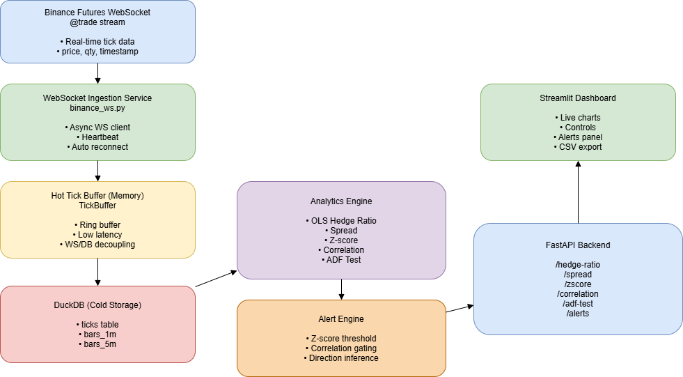

# 📊 Real-Time Quant Analytics Platform

**Statistical Arbitrage Monitoring & Research Tool**

---

## 📌 Overview

This project is a **real-time quantitative analytics application** designed to demonstrate end-to-end capabilities required of a Quant Developer — from **live market data ingestion** to **statistical analysis**, **alerting**, and **interactive visualization**.

The system consumes **live tick data from Binance Futures WebSocket**, processes and aggregates it into multiple timeframes, computes key **stat-arb analytics**, and presents results through an **interactive Streamlit dashboard** backed by a **FastAPI backend**.

---

## 🎯 Key Objectives

* Ingest real-time market tick data reliably
* Persist raw and aggregated data efficiently
* Compute statistically meaningful analytics for pair trading
* Provide near-real-time interactive visualizations
* Enable alerting based on quantitative rules
* Maintain architectural clarity and extensibility

---

## 🧱 Architecture Overview

### High-Level Components

```
Binance WebSocket
        ↓
WebSocket Ingestion Layer
        ↓
Hot Tick Buffer (In-Memory)
        ↓
Tick Writer (Async)
        ↓
DuckDB (Cold Storage)
        ↓
Resampling Engine
        ↓
Analytics Engine
        ↓
FastAPI Backend
        ↓
Streamlit Dashboard
```

---

### 📐 Architecture Diagram



### Editable Diagram Source

- draw.io source: [quant_analytics_architecture.drawio](architecture/quant-architecture.drawio)

## 🎬 Demo Walkthrough

👉 [Watch Demo Video](https://drive.google.com/file/d/1L9H1jbCUvrSP2FmG2Js2WwCN92KreL-8/view?usp=sharing)


The diagram shows:

* Real-time ingestion
* Hot vs cold data paths
* Background workers
* Analytics & alert flows
* API & frontend interaction

---

## ⚙️ Technology Stack

### Backend

* **Python 3.11**
* **FastAPI** — API layer
* **asyncio + websockets** — real-time ingestion
* **DuckDB** — analytical storage
* **Pandas / NumPy** — data processing
* **Statsmodels** — OLS & ADF test

### Frontend

* **Streamlit** — interactive dashboard
* **Plotly** — charts (zoom, pan, hover)

---

## 🚀 How to Run the Application

### 1️⃣ Setup Environment

```bash
python -m venv venv
source venv/bin/activate   # Windows: venv\Scripts\activate
pip install -r requirements.txt
```

### 2️⃣ Start Backend (Single Command)

```bash
uvicorn app:app --reload
```

This starts:

* WebSocket ingestion
* Tick persistence
* Continuous resampling
* API endpoints

### 3️⃣ Start Frontend

```bash
cd frontend
streamlit run dashboard.py
```

---

## 🔁 Data Ingestion Methodology

* Uses **Binance Futures WebSocket (`@trade`)**
* Each symbol runs in its **own async reconnect loop**
* Heartbeat (ping/pong) prevents silent disconnections
* Ticks are normalized into:

  ```
  { timestamp, symbol, price, qty }
  ```

### Hot Buffer Design

* In-memory ring buffer
* Decouples WebSocket speed from disk I/O
* Improves robustness and latency handling

---

## 🗄️ Storage & Resampling

### Raw Data

* Stored in DuckDB table: `ticks`

### Aggregated Data

* Resampled into:

  * `bars_1m`
  * `bars_5m`
* Metrics:

  * OHLC
  * Volume
  * VWAP

Resampling runs **continuously in background**, enabling analytics as soon as enough data becomes available.

---

## 📐 Analytics Methodology (Core of the Project)

### 1️⃣ Hedge Ratio (OLS Regression)

* Ordinary Least Squares on resampled prices
* Computes:

  * Alpha
  * Beta (hedge ratio)
  * R²
  * Observation count
* Used to define the **spread**

---

### 2️⃣ Spread

```
spread = price_x − (alpha + beta × price_y)
```

Represents relative mispricing between the pair.

---

### 3️⃣ Z-Score (Rolling)

```
z = (spread − rolling_mean) / rolling_std
```

* Rolling window configurable
* Used for **entry / exit signals**
* Handles insufficient data safely (no fake signals)

---

### 4️⃣ Rolling Correlation

* Correlation computed on rolling window
* Used as a **regime filter**
* Alerts only fire when correlation is sufficiently high

---

### 5️⃣ ADF Test (Augmented Dickey–Fuller)

* Run **on-demand**, not continuously
* Tests **stationarity of the spread**
* Used for **research validation**, not live trading
* Correctly handles non-stationary outcomes

---

## 🚨 Alerting System

### Rule-Based Alerts

Alerts trigger when:

```
|z_score| ≥ threshold
AND rolling_correlation ≥ correlation_threshold
```

Each alert includes:

* Timestamp
* Trading pair
* Z-score
* Correlation
* Direction:

  * `LONG_SPREAD`
  * `SHORT_SPREAD`

Alerts are intentionally transparent (no suppression) to show all qualifying statistical events.

---

## 📊 Frontend Dashboard

### Features

* Live price & spread charts
* Z-score visualization
* Rolling correlation plot
* Hedge ratio summary
* Active alerts panel
* CSV export
* ADF test trigger button

### Live Update Logic

* Dashboard polls backend every few seconds
* Analytics appear **only when enough data exists**
* Prevents misleading early-session outputs

---

## 📤 Data Export

* Processed analytics and time-series data can be exported as CSV
* Enables offline analysis and reproducibility

---

## 🤖 ChatGPT Usage Transparency

ChatGPT was used as a **support tool** for brainstorming architecture, clarifying quantitative concepts, debugging issues, and improving code and documentation clarity. All implementations, analytics logic, and design decisions were **reviewed, tested, and validated manually** by the developer. AI outputs were used for guidance only and not adopted without understanding. No confidential or sensitive data was shared.

---

## 📬 Author

**Prasad Ghadge**

---

